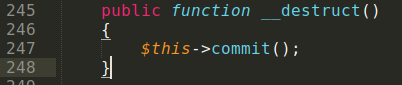
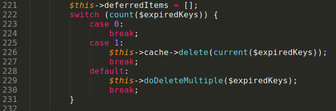
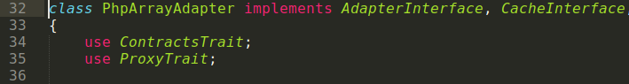
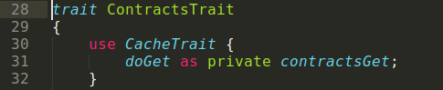
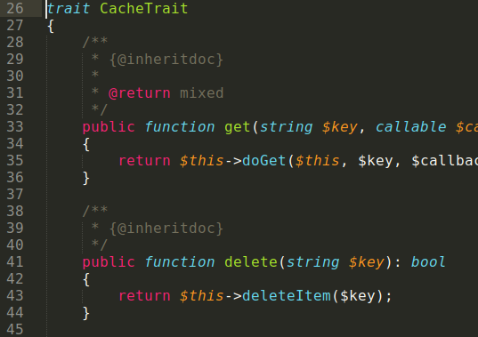
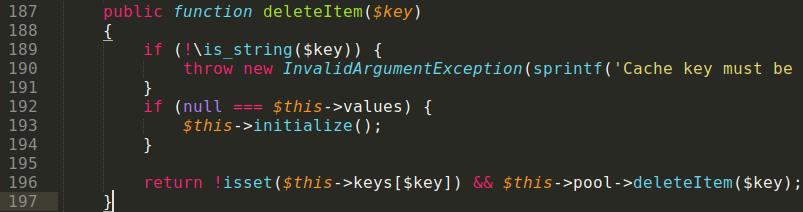
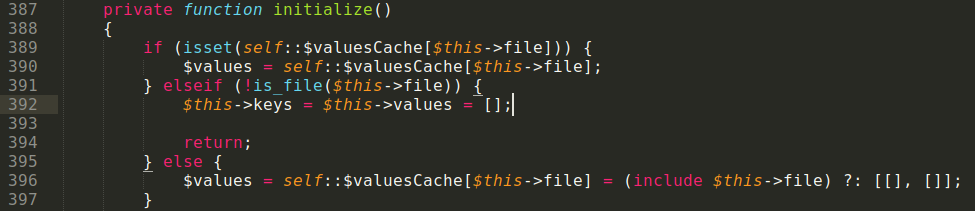
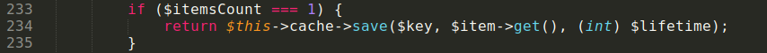
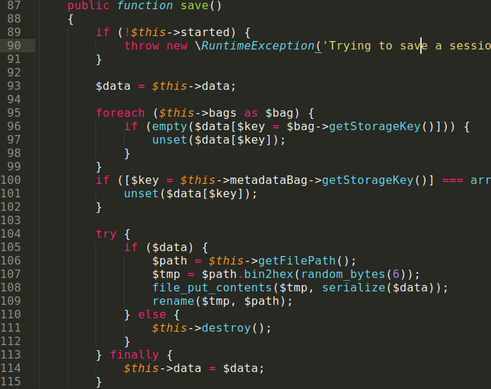

# doctrine/doctrine-bundle package unserialize RCE

Advisory demonstrates unserialize RCE POP-chain found in doctrine/doctrine-bundle package. Doctrine-bundle was created to make Doctrine and Symfony packages compatible.

Install doctrine/doctrine-bundle package with composer

$ cat composer.json
<pre>
{
   "require": {
       "doctrine/doctrine-bundle": "^2.7"
   }
}
</pre>
$ composer install

## Search code for gadgets

A way to get RCE is a little tricky, because it combines two POP-chains: arbitrary file write and arbitrary file inclusion.

### 1) Arbitrary file include POP-chain

Start from \_\_destruct in CacheAdapter class.

File doctrine/cache/lib/Doctrine/Common/Cache/Psr6/CacheAdapter.php

In «commit» method, call «delete» from any object.

Search for class with proper call-chain started with «delete» method was not easy. But it was found in PhpArrayAdapter class, where «delete» method was hidden in two <a href="https://www.php.net/manual/ru/language.oop5.traits.php">traits</a>.

File symfony/cache/Adapter/PhpArrayAdapter.php

File symfony/cache/Traits/ContractsTrait.php

What we see? Trait uses another trait!

File symfony/cache-contracts/CacheTrait.php

Now move to symfony/cache/Adapter/PhpArrayAdapter.php file again.

«deleteItem» method calls «initialize» method, with arbitrary file inclusion in it!

### 2) Arbitary file write POP-chain

Start again from \_\_destruct method in CacheAdapter class, move to “commit” method. Take another code path to trigger «save» method call.

Because PHP is weakly typed language, it does not require strict match for number of arguments when method called. We can successfully call “save” method with no arguments from MockFileSessionStorageclass.

File symfony/http-foundation/Session/Storage/MockFileSessionStorage.php

Serialized «data» property written into file with constant name taken from «getFilePath» method. Get arbitrary file write!

## Conclusion

This example demonstrates the case when it's difficult to directly find functions leading to RCE (eval, system, etc) in code. But it's possible to combine two attack vectors to get RCE.
Download exploit generator <a href="./doctrine_poi_gen.php">here</a>, and script to test POI <a href="./test_poi.php">here</a>.
