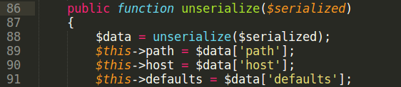
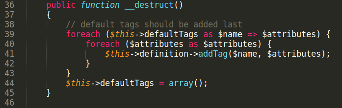
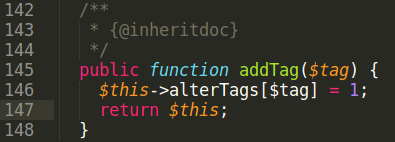

# Drupal &lt;= 8.7.14 and GMP Type Confusion RCE

This advisory demonstrates usage of [GMP Type confusion bug](https://github.com/CFandR-github/PHP-binary-bugs/blob/main/GMP_type_conf_unserialize/GMP_type_conf_advisory.md) in Drupal CMS.

Install Drupal from Composer. Create composer.json file:  
$ cat composer.json
<pre class="western">{
    "require": {
        "drupal/core": "8.7.14"
    }
}
</pre>
Run composer installer:  
$ composer install

To build exploit for GMP Type Confusion bug we need to find in web-application code:
1\) Class that implements Serializable interface\
2\) Code line executed from \_\_destruct method to rewrite object property\
3\) Find an object to rewrite props

Exploit build steps:\
1\) Search for class with Serializable interface in Drupal CMS.\
File vendor/symfony/routing/Route.php\
class Route implements \\Serializable

2\) Search for code line to rewrite object property that is reachable from \_\_destruct.\
File symfony/dependency-injection/Loader/Configurator/AbstractServiceConfigurator.php:\
abstract class AbstractServiceConfigurator extends AbstractConfigurator

File drupal/core/lib/Drupal/Core/Database/Query/Select.php:\
class Select extends Query implements SelectInterface

Make $this->alterTags array element a reference to GMP object in serialized string. In addTag method it is overwritten with integer 1.

3\) Use Composer object with handle = 0x1 and get arbitrary file include.\
Exploit build process is very similar with exploitation from previous <u>[advisory](https://github.com/CFandR-github/advisory/blob/main/symfony_process_gmp/symfony_0day_GMP_exploit.md)</u>.

In real pentest, this unserialize vector was used with [CVE-2019-6340](https://www.exploit-db.com/exploits/46510) (needs Drupal version &lt; 8.5.11 OR &lt; 8.6.10)\
POC can be found [here](./poc.php)