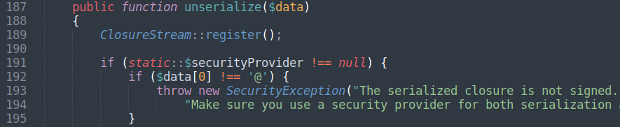
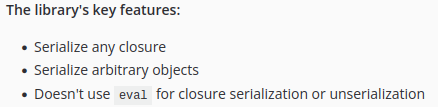
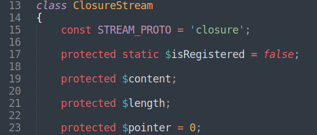
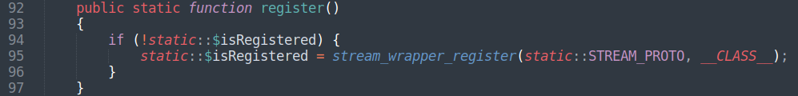
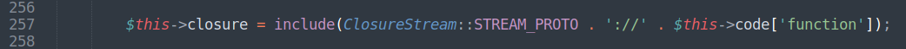
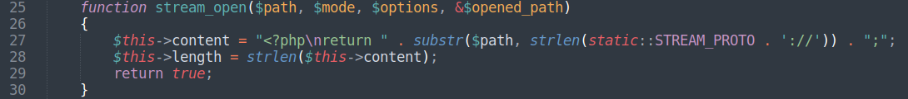
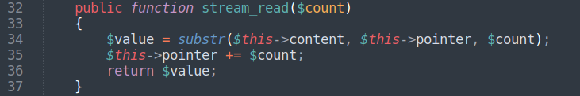
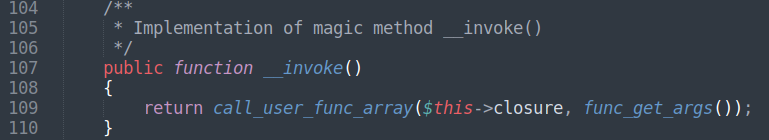
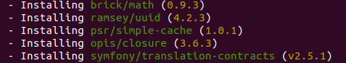

# opis/closure + laravel/framework unserialize RCE

**Opis Closure** is a library that aims to overcome PHP's limitations regarding closure serialization by providing a wrapper that will make all closures serializable [\[1\]](https://opis.io/closure/3.x/). Install it from Composer:
<pre>$ composer require opis/closure</pre>
Start Object Injection chain from SerializableClosure class.

Class SerializableClosure implements Serializable interface.

Enabled closure signing [\[2\]](https://opis.io/closure/3.x/security.html) heavily reduces the ability to use this class in Object Injection chain. Without knowlegde of SecurityProvider::secret attacker will be unable to pass hashsum verification. But by default closure signing is disabled and securityProvider variable is null.

Official documentation says:

Unserialized objects are created not within eval, but within custom stream wrapper.

Register custom protocol named «closure»

The protocol is accessed in the method SerializableClosure::unserialize:

**Include** function argument is passed as $path variable for [stream\_open](https://www.php.net/manual/ru/streamwrapper.stream-open.php) function.\
$this→content property is assigned with PHP-code.

**Include** function reads content from wrapper, it is done with [stream\_read](https://www.php.net/manual/en/streamwrapper.stream-read.php) call. PHP-code is returned.

Returned code is executed inside **include**. The resulting POI string:
<pre>
C:32:"Opis\\Closure\\SerializableClosure":48:{a:1:{s:8:"function";s:19:"system('uname -a');";}}
</pre>
No need to search for \_\_invoke call to start POI.

Why was this package taken?\
If PHP 7.x is used as default PHP,  when laravel/framework package installs, Composer manager installs version 8.83.x for it. You can test what packages will be installed with Laravel using **--dry-run** command [\[3\]](https://getcomposer.org/doc/03-cli.md).
<pre>$ composer require laravel/framework --dry-run</pre>

What we see? opis/closure package!\
When web-developer installs laravel/framework package from Composer for PHP 7.x, opis/closure is also installed. Autoloader is generated for all installed packages. Opis unserialize vector works with Laravel. Maybe it is the easiest way to get unserialize RCE for Laravel framework.

Download POC [here](./opis_closure_poi.php).

References: 
1. [https://opis.io/closure/3.x/](https://opis.io/closure/3.x/)
2. [https://opis.io/closure/3.x/security.html](https://opis.io/closure/3.x/security.html)
3. [https://getcomposer.org/doc/03-cli.md](https://getcomposer.org/doc/03-cli.md)