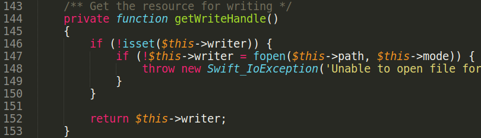
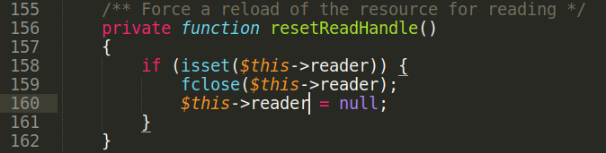

# phpmailer + swiftmailer 0day unserialize RCE

Requirements:

- Any PHP version
- Any phpmailer/phpmailer version
- package swiftmailer/swiftmailer &lt;= 6.2.4

This advisory demonstrates usage of reference (R:) serialization and fast “\_\_destruct” method call in PHP unserialize exploits. PHPMailer has some interesting code reachable from \_\_destruct. But code needs to pass **is\_resource(\$this-&gt;smtp\_conn)** condition. Resource type can’t be serialized in PHP. The idea is to create resource during unserialization process and use reference to object property with resource.

Install software:

$ cat composer.json
<pre>
{
 "require": {
 "phpmailer/phpmailer": "6.6.0",
 "swiftmailer/swiftmailer" : "6.2.4"
 }
}
</pre>
$ composer install

1\) Create resource using Swiftmailer package. Start from \_\_destruct.

File swiftmailer/swiftmailer/lib/classes/Swift/Transport/AbstractSmtpTransport.php:

File swiftmailer/swiftmailer/lib/classes/Swift/ByteStream/FileByteStream.php:

$this→writer is set to resource on line 147. $this→reader property is PHPMailer object in serialized string.

fclose call on line 159 with object argument makes only Warning message, execution continues.

On line 160 $this→reader property is assigned to null. It leads to immediate \_\_destruct call.

2\) Call \_\_destruct of PHPMailer object

File phpmailer/phpmailer/src/PHPMailer.php:

File phpmailer/phpmailer/src/SMTP.php:

$this→smtp\_conn is reference to $this→writer property in serialized string. $this→writer is set to resource, and condition on line 658 passes. Return **true** from “connected” method and call “edebug” method.

Execute method of any object using **call\_user\_func**. Set $this→Debugoutput with array.\

<pre>s:11:"Debugoutput";a:2:{i:0;O:29:"PHPMailer\\PHPMailer\\PHPMailer":2:{s:6:"Mailer";s:8:"sendmail";s:8:"Sendmail";s:22:"/bin/sh -c "uname -sp"";}i:1;s:8:"postSend";}}}</pre>

Execute postSend method. File phpmailer/phpmailer/src/PHPMailer.php:

Call popen to get code execution in sendmailSend method:

Exploit POC can be found [here](./phpmailer_poc.php).