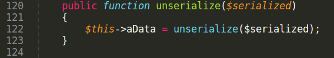
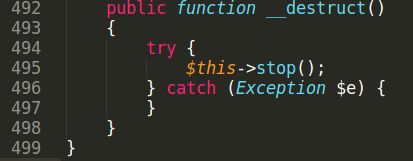
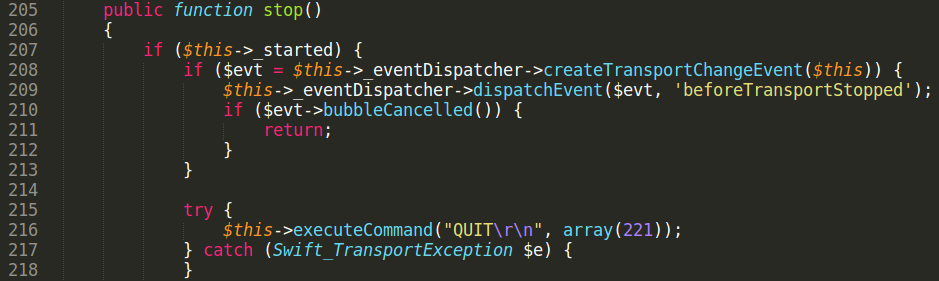
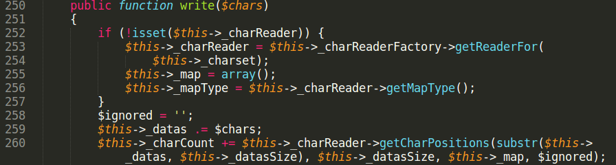
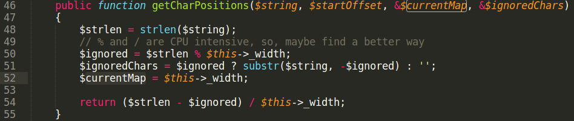

# Package swiftmailer/swiftmailer 0day GMP RCE

To build exploit for GMP Type Confusion bug we need to find in code:\
1\) Class that implements Serializable interface\
2\) Code line executed from \_\_destruct method to rewrite object property\
3\) Find an object to rewrite props\
Packages "swiftmailer/swiftmailer" and "pear/net_geoip" were taken for analysis.

$ cat composer.json
<pre>
{
 "require": {
 "swiftmailer/swiftmailer": "5.4.12",
 "pear/net_geoip":"1.0"
 },
 "minimum-stability": "dev"
}
</pre>
$ composer install

1\) Search for class with Serializable interface.\
File pear/net\_geoip/Net/GeoIP/Location.php\
class Net\_GeoIP\_Location implements Serializable

2\) Search for code line to rewrite object property that is reachable from \_\_destruct.\
File swiftmailer/lib/classes/Swift/Transport/AbstractSmtpTransport.php\
abstract class Swift\_Transport\_AbstractSmtpTransport implements Swift\_Transport

Need set some properties in serialized string to get into "write" method of class Swift\_CharacterStream\_NgCharacterStream.\
File swiftmailer/lib/classes/Swift/CharacterStream/NgCharacterStream.php

File swiftmailer/lib/classes/Swift/CharacterReader/GenericFixedWidthReader.php

Method getCharPositions called in line 260 with third argument $this→\_map.

In getCharPositions method third parameter $currentMap is passed by reference. And on line 52 it is modified: 
<pre>$currentMap = $this→_width;</pre>

This is what we are searching for.
$this→\_map is a reference to GMP object in serialized string. On line 52 it is rewritten with integer zval.

3\) Use Composer object with handle = 0x1 and get arbitrary file include.\

Exploit build process is very similar with exploitation discussed in previous [advisory](https://github.com/CFandR-github/advisory/blob/main/symfony_process_gmp/symfony_0day_GMP_exploit.md).