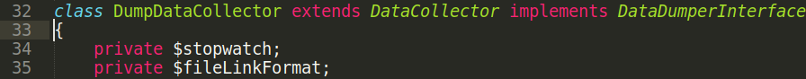
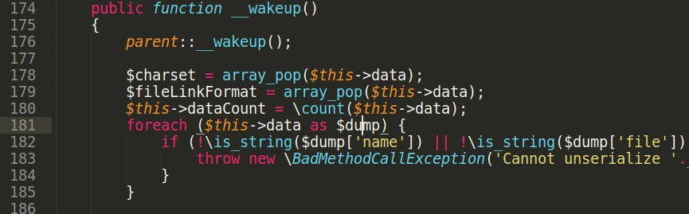
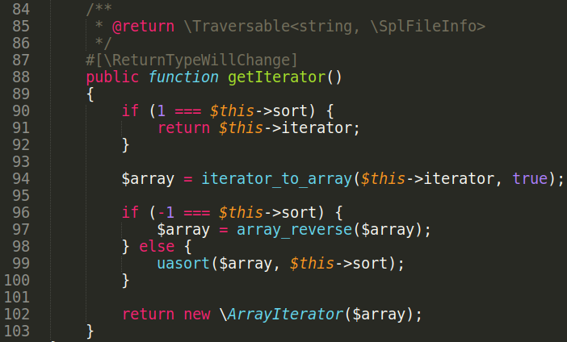
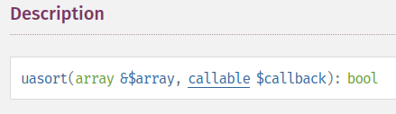
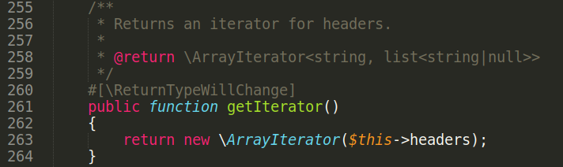
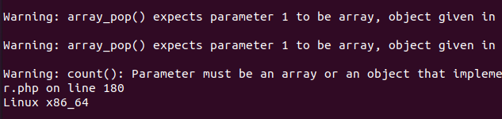

# Package symfony/finder unserialize RCE

This advisory demonstrates another unserialize RCE found in Symfony project.\
Requirements:
- packages symfony/finder and symfony/http-kernel
- Any PHP 7.x version

Install packages from Composer:\
$ cat composer.json
<pre>
{
 "require": 
 "symfony/finder": "5.4.8",
 "symfony/http-kernel": "5.4.9",
 "symfony/service-contracts" : "2.5.1"
 }
}  
</pre>
$ composer install\

Lets look closer at POI-chain. Start from file vendor/symfony/http-kernel/DataCollector/DumpDataCollector.php:

This class has interesting \_\_wakeup method:

On line 181 $this→data property is set in serialized string. Foreach loop can call getIterator() method from another class that implements IteratorAggregate interface. Search for that class.\

File symfony/finder/Iterator/SortableIterator.php:\
class SortableIterator implements \\IteratorAggregate

How to get command execution from this method?\
See description of **uasort** function on php.net:

First parameter is array to be sorted.\
Second parameter is the comparison function. It can be any callable, set it to "**system**".\
To pass iterator\_to\_array call on line 94, set $this→iterator as an object of class HeaderBag.\
File vendor/symfony/http-foundation/HeaderBag.php:\
class HeaderBag implements \\IteratorAggregate, \\Countable\
Set this→headers an array to be passed into **uasort**.

Get RCE:

Download full POC here.