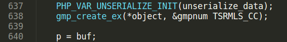
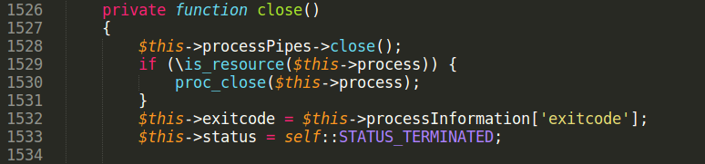

## Unfixed GMP Type Confusion

Requirements: PHP &lt;= 5.6.40\
Compiled with: '--with-gmp', '--enable-sigchild'\
Software: packages symfony/process, symfony/routing &lt;= 3.4.47 installed from Composer

Original GMP Type confusion bug was found by taoguangchen researcher and reported \[1\].
The idea of exploit is to change zval structure \[2\] of GMP object during deserialization process.
In original exploit author says about changing zval type using this code lines:
<pre class="western">	function __wakeup()
        {
            $this->ryat = 1;
        }
</pre>

PHP supports serialization/deserialization of references. It is done using "R:" syntax. $this→ryat property is a reference to GMP object. Rewrite of $this→ryat property leads to rewrite of GMP zval.
There are many ways to rewrite zval in PHP, easies is code line like this:\
$this→a = $this→b;\
Part of exploit is to find this line in code of real web-application, and execute it during deserialization process.

Bug in GMP extension was "fixed" as part of delayed \_\_wakeup patch. But source code in gmp.c file was not patched. So bypassing delayed \_\_wakeup would result that this bug is still exploitable. Delayed \_\_wakeup patch was introduced in PHP 5.6.30. Generally it was a patch to prevent use-after-free bugs in unserialize. Exploits using use-after-free bugs are based on removing zval’s from memory in the middle of deserialization process and further reusing freed memory. Introduced patch suspends execution of object’s \_\_wakeup method after deserialization process finishes. It prevents removing zval’s from memory during deserialization process.

But there is another way to execute code in the middle of deserialization in PHP. In PHP there exists Serializable interface \[3\] It is for classes that implement custom serialization/deserialization methods. Deserialization of these classes can not be delayed. They have special syntax in unserialize starting with "C:". In real web-apps "unserilaize" methods are small and don’t have code lines to rewrite zval.
<pre class="western">public function unserialize($data) {
	unserialize($data);
}
</pre>
If $data is invalid serialization string (bad format), unserialize($data) call will not throw any fatal error. Deserialization process will continue after unserializing custom-serialized object. This can be used to trigger \_\_destruct method using unclosed brace in serialized $data string. Code of \_\_destruct method will be executed in the middle of unserialization process! In code of \_\_destruct method there is a big chance to find code lines that rewrite zval. The only restriction for this trick is to find a class in web-application code that implements Serializable interface.

As real-world example two packages from Symfony were taken: symfony/process \[4\] and symfony/routing \[5\]. These packages are part of Drupal/PHPBB3 and other projects. Packages are installed from Composer manager \[6\].

Create composer.json file:\
$ cat composer.json
<pre class="western">{
 	"require": {
 	"symfony/process": "v3.4.47",
 	"symfony/routing": "v3.4.47"
 	}
}
</pre>
Run composer installer:\
$ composer install

Installer creates *vendor* directory with PHP source files.
Search for code line to rewrite zval:\
$this-&gt;exitcode = $this→processInformation\['exitcode'\];\
This line located in method of class Process and *very possible* can be reached from \_\_destruct method.

Search for class that implements Serializable\
./routing/Route.php:class Route implements \\Serializable\
It has unserialize method with another unserialize function call.

Let us run exploit and understand how it works.\
Set two breakpoints in gdb. First, when GMP object is created.\
gdb-peda$ b gmp.c:640

Another breakpoint, where type confusion bug happens.\
gdb-peda$ b gmp.c:661

Rub gdb, unserialization of GMP object properties starts.\
Stop on line 640 and print object zval. It is GMP object with handle = 0x3

Set breakpoint on unserialize call.\
gdb-peda$ b var.c:967\
Continue execution.

Execution reaches second unserialize function call, located in unserialize method of Route class.

Because of invalid serialization string (it hash "A" char instead of closing bracket at the end), php\_var\_unserialize call returns false and zval\_dtor(return\_value) is called. If the zval\_dtor argument has object type, it’s \_\_destruct method executes.

Output return\_value using printzv macros. It is object of *Process* class with unserialized properties.

Start POI chain from \_\_destruct method of Process class:

Code line to rewrite zval is located in close() method.
$this-&gt;exitcode = $this→processInformation\['exitcode'\];
Execution reaches updateStatus method:

Another problem is that proc\_get\_status returns false because $this→process is not resource.
$this-&gt;processInformation property is assigned to false. So we can’t set $this-&gt;processInformation right in serialized string.
There is some code after proc\_get\_status called:

<pre class="western">
 if ($this-&gt;fallbackStatus &amp;&amp; $this-&gt;enhanceSigchildCompatibility &amp;&amp; $this-&gt;isSigchildEnabled()) {
      $this-&gt;processInformation = $this-&gt;fallbackStatus + $this-&gt;processInformation;
 }
</pre>
To pass $this→isSigchildEnabled() condition PHP needs to be compiled with "–enable-sigchild" option.\
If processInformation is false, addition of false and array gives Fatal error and script stops. But we need to write into processInformation by somehow.
In PHP language, variable is deleted from memory, when it’s refcount becomes 0. If a variable is an object, it’s \_\_destructor method executes. Look closer on this line:
<pre>$this-&gt;processInformation = proc_get_status($this→process);</pre>
Rewrite of processInformation property can lead to \_\_destruct execution because refcount becomes 0. We can use reference (R:) again to rewrite processInformation in called \_\_destruct method. ProcessInformation needs to have an array type not to throw Fatal error. There is another class in symfony/process that has empty array assignment.\
abstract class AbstractPipes implements PipesInterface

Make $this-&gt;pipes reference to $this→processInformation. They point into same zval in memory. When $this→pipes is assigned an empty array, then $this→processInformation too.\
$this-&gt;fallbackStatus is merged with $this-&gt;processInformation

After that close() method executes where line of code to rewrite zval is located.
$this-&gt;exitcode is reference to GMP object in serialized string, writing into $this-&gt;exitcode rewrites zval of GMP object. Value to write is taken from $this→fallbackStatus\[‘exitcode’\] and equal to **i:1;** in exploit string.
Continue execution.

See what happened with GMP zval.

Handle of GMP zval is equal to fallbackStatus\[‘exitcode’\] it is 0x1.
See what function zend\_std\_get\_properties does.

Z\_OBJ\_HANDLE\_P(zval\_p) Z\_OBJ\_HANDLE(\*zval\_p) \
\#define Z\_OBJ\_HANDLE(zval) Z\_OBJVAL(zval).handle \
\#define Z\_OBJVAL(zval) (zval).value.obj

Z\_OBJ\_HANDLE\_P(zval\_p) returns zval\_p.value.obj.handle it is an object handle taken from zval structure. Z\_OBJ\_P macro takes a object handle number, and returns property hashtable of object with the given handle number. zend\_hash\_copy copies props of GMP object into this hashtable.
Handle number is fully controlled from exploit. Using this bug an attacker can rewrite props of any object in PHP script.

What object is good to rewrite properties? Symfony packages were installed using Composer. Composer has class autoloading mechanism. When autoload.php script included, object ClassLoader registered by spl\_autoload\_register as class autoload handler. When any new not loaded class is used, autoload handler executes.

classMap property stores a dictionary of classes and files for this classes to be autoloaded. Rewrite classMap property of ClassLoader object results into arbitrary file include.

Many applications include ‘autoload.php’ very first. ClassLoader object will have handle = 0x1! 
No need to bruteforce handle. It makes exploit very stable.
To write 0x1 into handle id no need to create integer zval, attacker can use boolean type. PHP boolean type is represented in memory as 0 or 1 integer. Code lines like $this→prop = true are more common in real code than property assignment demonstrated previously. Most importantly, with boolean zval it is still possible to overwrite Composer object. Usage of $this→prop=true is demonstrated in another advisory.

References:

\[1\] <u><https://bugs.php.net/bug.php?id=70513></u>
\[2\] <u>[https://www.phpinternalsbook.com/php5/zvals/basic\_structure.html](https://www.phpinternalsbook.com/php5/zvals/basic_structure.html)</u>
\[3\] <u><https://www.php.net/manual/en/class.serializable></u>
\[4\] <u><http://packagist.org/packages/symfony/process></u>
\[5\] <u><http://packagist.org/packages/symfony/routing></u>
\[6\] <u><https://getcomposer.org/></u>