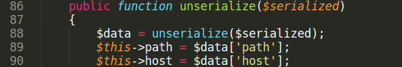

# Variable rewrite with boolean and GMP Type Confusion

To build exploit for GMP Type Confusion bug we need to find in code:\
1\) Class that implements Serializable interface\
2\) Code line executed from \_\_destruct method to rewrite object property\
3\) Find an object to rewrite props

Symfony package "symfony/dependency-injection" was taken for analysis.

$ cat composer.json
<pre>
{
 "require": {
 "psr/container":"1.0.0",
 "symfony/dependency-injection": "3.4.47",
 "symfony/routing": "3.4.47"
 }
}
</pre>

$ composer install

1\) Search for class with Serializable interface.\
File symfony/routing/Route.php:\
class Route implements \\Serializable

2\) Search for code line to rewrite object property that is reachable from \__destruct.\
Package "symfony/dependency-injection" has small number of \_\_destruct methods. And it has no code line to write property field into another property field, reachable from \_\_destruct. But package has line:
<pre>$this-&gt;removedBindingIds[(int) $bindingId] = true;</pre>
in removeBindings method.\
In PHP, boolean variable is represented in memory as 0 or 1 integer. It is enough to rewrite handle of GMP object with value 0x1. In the finish of GMP deserialization we rewrite Composer object props, because it has handle = 0x1.

File symfony/dependency-injection/Loader/Configurator/ServiceConfigurator.php:\
Class ServiceConfigurator extends AbstractServiceConfigurator

File symfony/dependency-injection/ContainerBuilder.php:\
class ContainerBuilder extends Container implements TaggedContainerInterface

3\) Use Composer object with handle = 0x1 and get arbitrary file include.\
Exploit build process is very similar with exploitation from previous [advisory](https://github.com/CFandR-github/advisory/blob/main/symfony_process_gmp/symfony_0day_GMP_exploit.md).

Generated exploits can be found [here](https://github.com/CFandR-github/advisory/tree/main/symfony_rewrite_into_bool/generated_poi/).