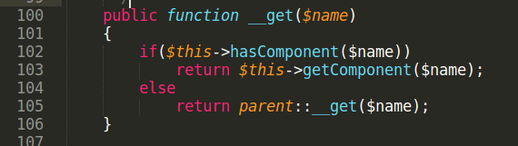
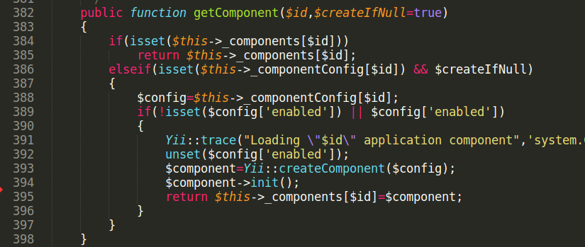
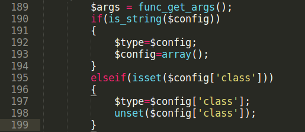
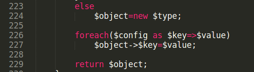
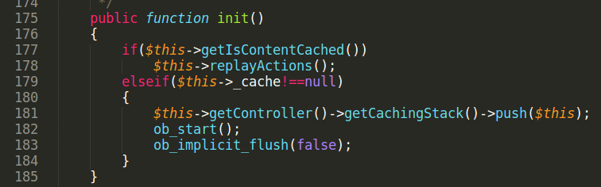
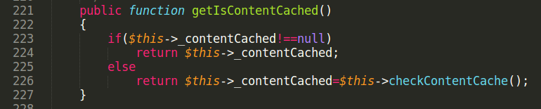
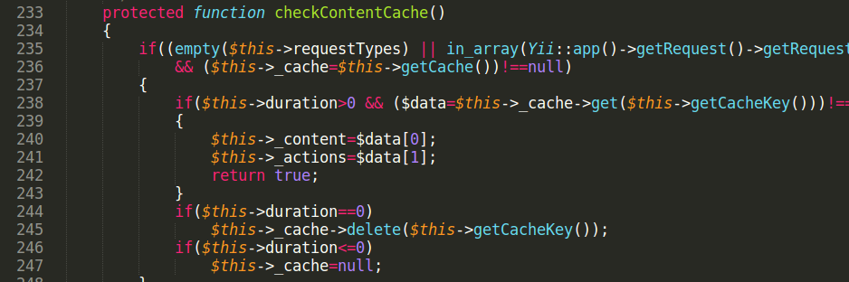
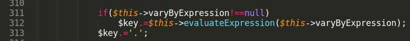
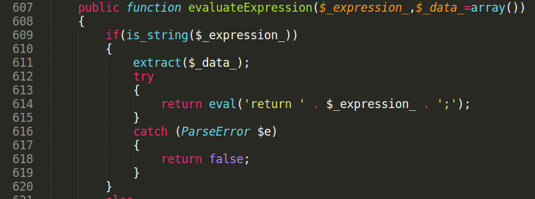

# Yii 1.x unserialize RCE 

Requirements:
- any Yii 1.x version
- need property read from unserialized object

Install Yii 1.x from Composer:\
$ composer require yiisoft/yii\
Create Yii test page with minimal code to initialize web-application.
<pre>
require './vendor/autoload.php';
require './vendor/yiisoft/yii/framework/yii.php';

$config = array('basePath'=> '/var/www/', 'components' => array('cache' => array('class' => 'CDummyCache')));
Yii::createWebApplication($config);
</pre>

Start object injection from "magic" method \_\_get. File yiisoft/yii/framework/base/Cmodule.php:

If there is no component in $this→\_components array, the component configuration is taken from $this-&gt;\_componentConfig array, and component is initialized using Yii::createComponent.

Jump to Yii:createComponent in yiisoft/yii/framework/YiiBase.php. There is arbitrary object instantiation!

We control class name, constructor arguments and object properties.

After component creation, call init() method on line 394. Component has class CoutputCache.\
File yiisoft/yii/framework/web/widgets/COutputCache.php

In getCacheKey method evaluateExpression is called.

**Finally get eval** call in evaluateExpression method! File yiisoft/yii/framework/base/Ccomponent.php:

[POC](./yii1_rce_poi.php) can be found here.